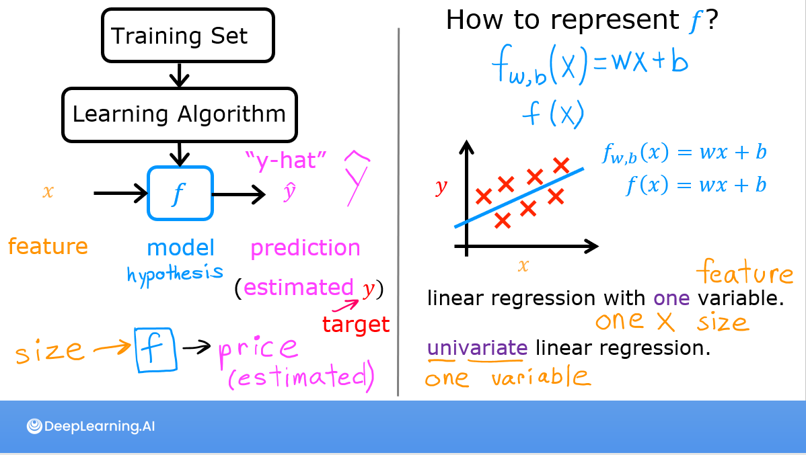
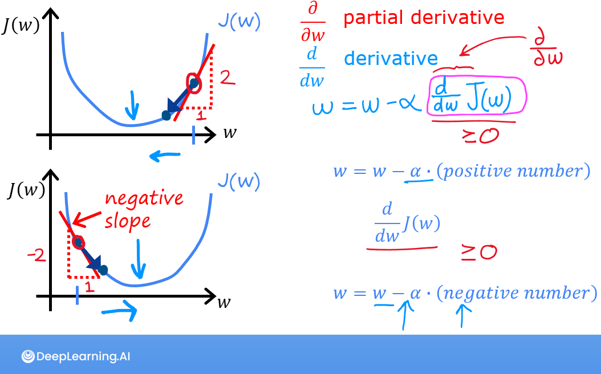

# 监督学习

X->y Learn from being given the "right answers"

## 回归Regression

从无数可能的数字预测出一个数字
predict numbers & large number possible outputs
房价预测
判断垃圾邮件
预测用户是否点击广告

### 线性回归模型


$\hat{y}$:预测值 $y$:实际值
$$f_{W,b}(x) = Wx+b$$
单个变量(feature)的线性回归，需要找到对应的W和b能很好的拟合数据

#### 重点：构建cost function(代价函数)

##### 定义

$$J{(w,b)} = \frac{1}{2m} \sum_{i=1}^{m} (y^{(i)} - f_{W,b}(x))^2 $$
or
$$J{(w,b)} = \frac{1}{2m} \sum_{i=1}^{m} (y_i - \hat{y}_i)^2 $$
m:训练集数据量
损失函数用来衡量模型预测结果与实际结果之间差异的函数。其值越小，代表模型预测结果越接近实际结果。在训练模型时，需要通过不断调整模型参数来最小化损失函数的值。

##### 直觉

$$minimizeJ(w,b) \atop{w,b}$$
Your goal is to find a model $$f_{w,b}(x) = wx + b$$, with parameters  $w,b$,
which will accurately predict house values given an input $x$.
The cost is a measure of how accurate the model is on the training data.

```python 
def compute_cost(x, y, w, b):
    """
    Computes the cost function for linear regression.
    
    Args:
      x (ndarray (m,)): Data, m examples 
      y (ndarray (m,)): target values
      w,b (scalar)    : model parameters  
    
    Returns
        total_cost (float): The cost of using w,b as the parameters for linear regression
               to fit the data points in x and y
    """
    # number of training examples
    m = x.shape[0]
    cost_sum = 0
    for i in range(m):
        f_wb = w * x[i] + b
        cost = (f_wb - y[i]) ** 2
        cost_sum = cost_sum + cost
    total_cost = (1 / (2 * m)) * cost_sum

    return total_cost

``` 


```python

x_train = np.array([1.0, 1.7, 2.0, 2.5, 3.0, 3.2])
y_train = np.array([250, 300, 480, 430, 630, 730, ])

plt.close('all')
fig, ax, dyn_items = plt_stationary(x_train, y_train)
updater = plt_update_onclick(fig, ax, x_train, y_train, dyn_items)
```

$$f_{w}(x) = wx$$

$$f_{w,b}(x) = wx + b$$
w,b自变量。所以是三维图形，可以取切面最密集的点就是拟合最好的w和b


### 梯度下降算法Gradient descent algorithm

本质上是通过对当前$w,b$所在的位置进行修正，找到(1)式最低点的算法。  
So far in this course, you have developed a linear model that predicts $f_{w,b}(x^{(i)})$:
$$f_{w,b}(x^{(i)}) = wx^{(i)} + b \tag{1}$$
In linear regression, you utilize input training data to fit the parameters $w$,$b$ by minimizing
a measure of the error between our predictions $f_{w,b}(x^{(i)})$ and the actual data $y^{(i)}$.
The measure is called the $cost$, $J(w,b)$.
In training, you measure the cost over all of our training samples $x^{(i)},y^{(i)}$
$$J(w,b) = \frac{1}{2m} \sum\limits_{i = 0}^{m-1} (f_{w,b}(x^{(i)}) - y^{(i)})^2\tag{2}$$
重复直到收敛
$$\begin{align*} \lbrace \newline
\; w &= w - \alpha \frac{\partial J(w,b)}{\partial w} \tag{3} \; \newline
b &= b - \alpha \frac{\partial J(w,b)}{\partial b} \newline \rbrace
\end{align*}$$
$\alpha$：0,1之间。代表梯度下降的速率(learning rate)。越大越激进

1.重复更新w,b的值直到算法收敛，即w,b每次更新都不会发生太大变化了

2.$w,b$同时更新，异步更新可能会造成问题

Where parameters$w$, $b$ are updated simultaneously.  
The gradient is defined as:
$$\begin{align}
\frac{\partial J(w,b)}{\partial w} &= \frac{1}{m} \sum\limits_{i = 0}^{m-1} (f_{w,b}(x^{(i)}) - y^{(i)})x^{(i)} \tag{4}\\
\frac{\partial J(w,b)}{\partial b} &= \frac{1}{m} \sum\limits_{i = 0}^{m-1} (f_{w,b}(x^{(i)}) - y^{(i)}) \tag{5}\\
\end{align}$$


3.越接近local minimum
-  $$\frac{\partial J(w,b)}{\partial w}$$Derivative becomes smaller
- $\delta{w}$Update steps become smaller
$\alpha$过大或过小造成的影响
过大：达不到最低点，无法收敛(converge) 甚至发散(diverge)
过小：步骤多且耗时

### 多元线性回归Multiple Variable Linear Regression
#### 向量化Vectorization
向量化:np.dot(w,x) + b
No 向量化(循环计算):$$f = w[0] * x[0] + w[1] * x[1] + w[2] * x[2] + b$$
[图片]
使用向量计算dot而非循环计算的好处：利用并行计算提升效率
[图片]

[图片]
多类特征Multiple features
单个特征—>多个特征:$$x->$$$$x_1,x_2,...$$
占地面积->占地面积，卧室数量...
使用list存储
[图片]
examples are stored in a NumPy matrix X_train. Each row of the matrix represents one example. When you have $$m$$
training examples ( $$m$$ is three in our example), and there are $$n$$ features (four in our example), $$\mathbf{X}$$
is a matrix with dimensions ($$m$$, $$n$$) (m rows, n columns).

          $$\mathbf{X} = 

\begin{pmatrix}
x^{(0)}_0 & x^{(0)}_1 & \cdots & x^{(0)}_{n-1} \\
x^{(1)}_0 & x^{(1)}_1 & \cdots & x^{(1)}_{n-1} \\
\cdots \\
x^{(m-1)}_0 & x^{(m-1)}_1 & \cdots & x^{(m-1)}_{n-1}
\end{pmatrix}$$
notation:
- $$\mathbf{x}^{(i)}$$ is vector containing example i. $$\mathbf{x}^{(i)}$$ $$ = (x^{(i)}_0, x^{(i)}_1, \cdots,x^{(i)}_
{n-1})$$
- $$x^{(i)}_j$$ is element j in example i. The superscript in parenthesis indicates the example number while the
subscript represents an element.  
学习率learning rate
[图片]

[图片]
$$\alpha$$控制了参数更新的速率
[图片]

[图片]
提高学习率$$\alpha$$和增加迭代次数，作用都不大，如何解决？